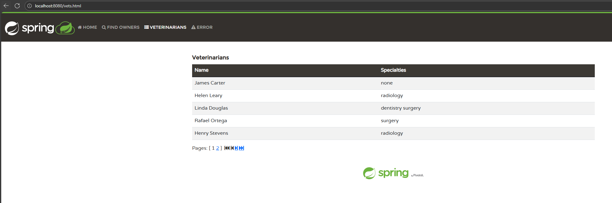
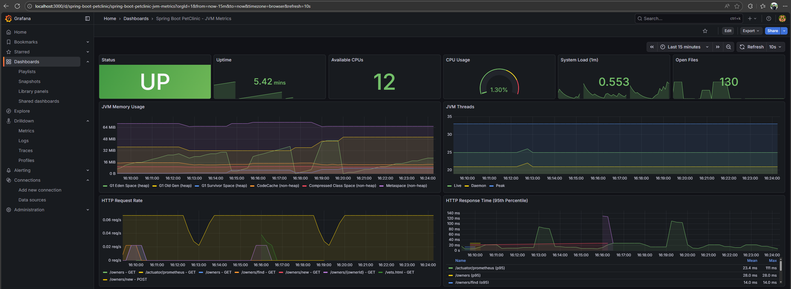
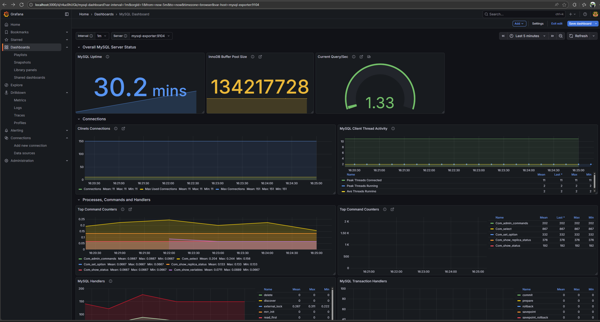
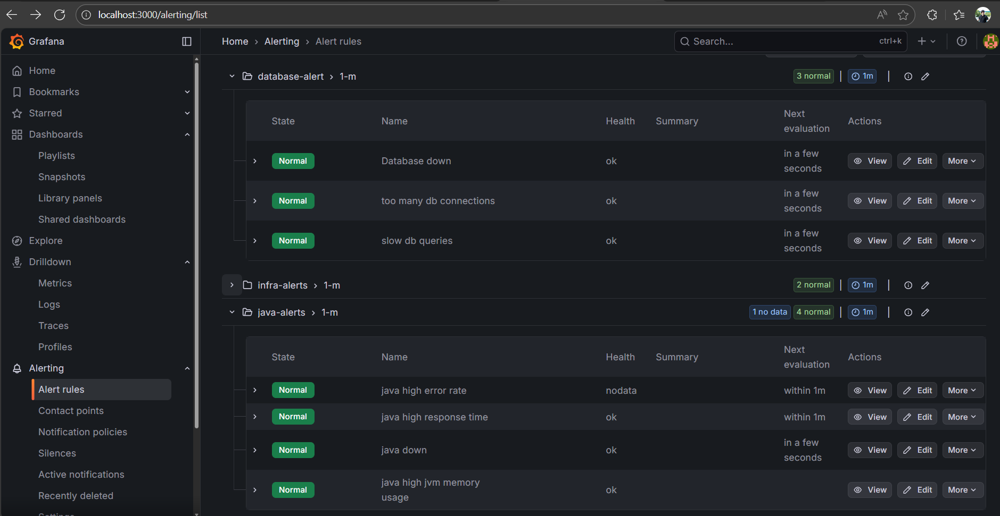
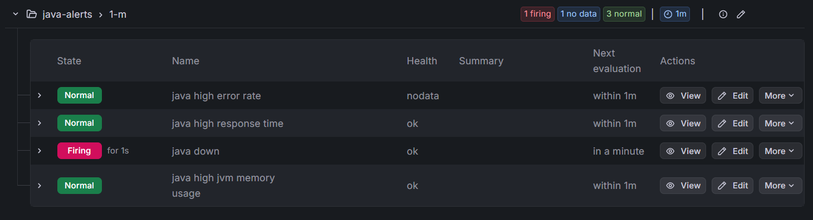
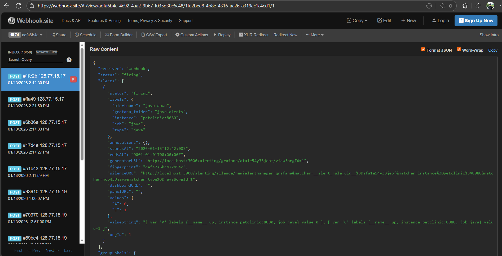
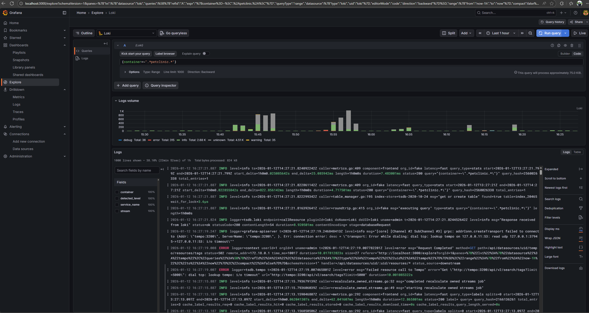
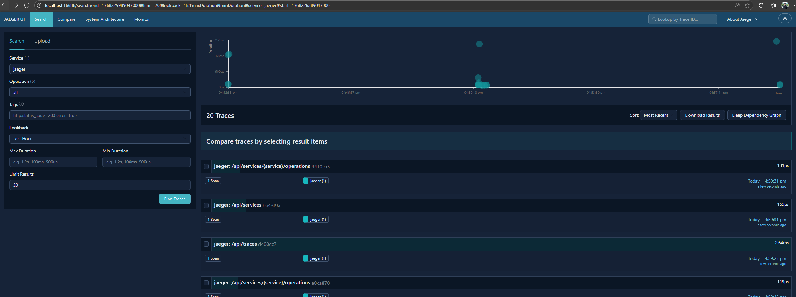

# Monitoring Setup

Simple observability stack for Spring PetClinic: Prometheus, Grafana, Loki, and Jaeger.

## Quick Start

### 1. Configure MySQL Exporter Credentials

Copy the example file and add your database credentials:

```bash
cp monitoring/mysql-exporter.cnf.example monitoring/mysql-exporter.cnf
cp monitoring/.env.example monitoring/.env
```

Edit `monitoring/mysql-exporter.cnf` with your MySQL credentials:
```ini
[client]
user=your_username
password=your_password
host=mysqlserver
port=3306
```

Edit `monitoring/.env` with your MySQL credentials:

### 2. Start Services

All services run in Docker Compose:

```bash
cd spring-petclinic-docker
docker compose up -d
```



## Access Points

- **Grafana**: http://localhost:3000 (admin/admin)
- **Prometheus**: http://localhost:9090
- **Jaeger**: http://localhost:16686
- **Loki**: http://localhost:3100 (API only)
- **App**: http://localhost:8080

## What's Monitored

- **Metrics**: JVM, HTTP requests, database via Prometheus
- **Logs**: Container logs via Loki
- **Traces**: Distributed traces via Jaeger
- **Dashboards**: Custom Spring Boot + MySQL dashboards in Grafana

## Usage

### View Metrics
1. Open Grafana → Dashboards
2. Select "Spring Boot - JVM Metrics" or "MySQL"

Spring Boot - JVM Metrics Dashboard:



MySQL Dashboard:



### Alerts
Alerts:



Example of taking java down:



Webhook got notified:



### View Logs with Loki
1. Open Grafana → Explore
2. Select "Loki" datasource



### View Logs in Drilldown:


### View Traces
1. Open Jaeger UI → http://localhost:16686



### Profiling with Pyroscope


## Configuration Files

- `prometheus.yml` - Metrics scrape config
- `loki-config.yml` - Log aggregation
- `jaeger-ui.json` - Jaeger UI theme
- `grafana/provisioning/` - Auto-configured dashboards and datasources

